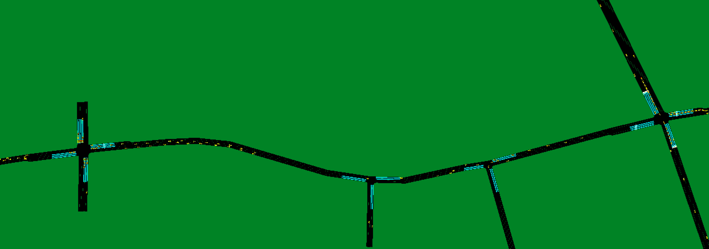
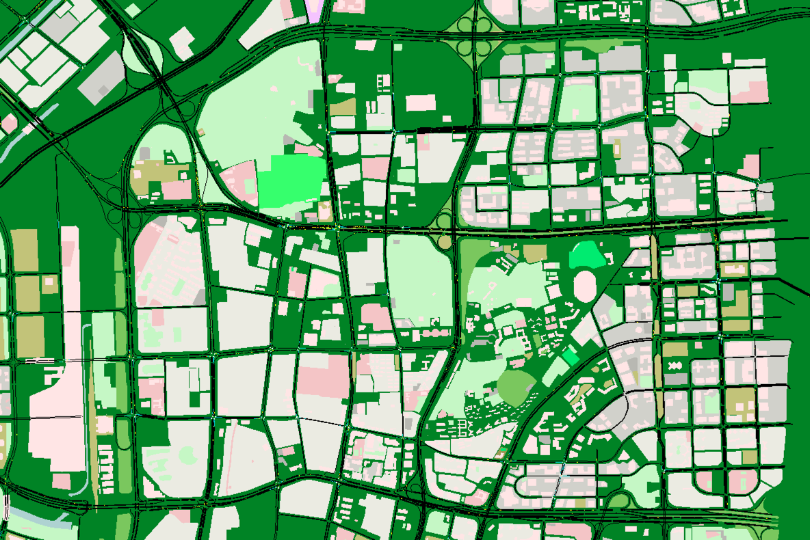
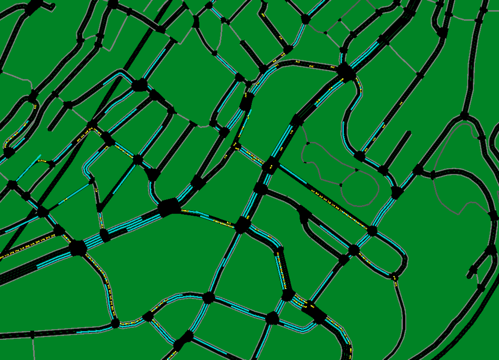
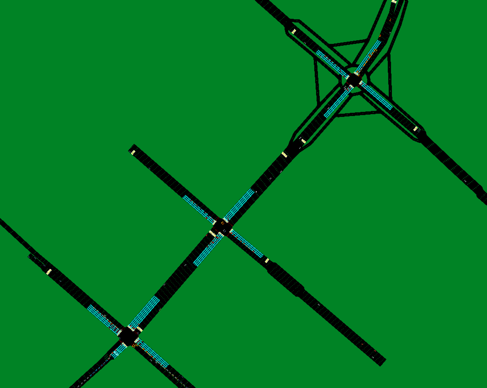

## Sumo Envs
Now, there are 5 base environments for training agents. The env of Fenglin road is based on real word roadmap and od!

Example scenarios:  
- Large grid(5*5):  
- Fenglin road: 
- Nanshan: 
- 
- 

### Usage
First, you need to [install sumo](https://sumo.dlr.de/docs/Downloads.php).

Then you can use "sumo-gui" to visualize and interact with envs, just to open simulation with *.sumocfg file in each scenario's folder.

