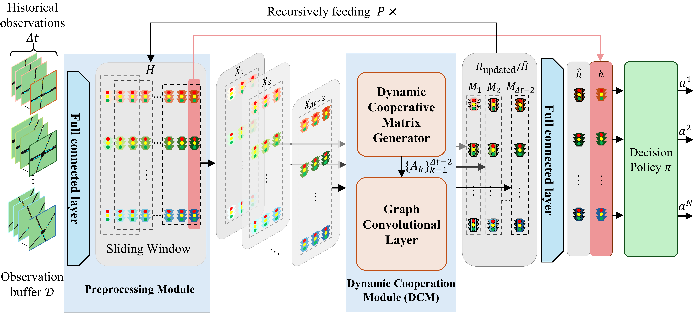
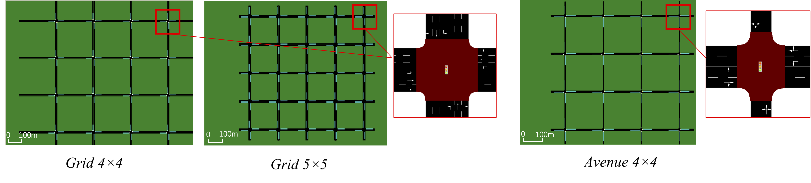
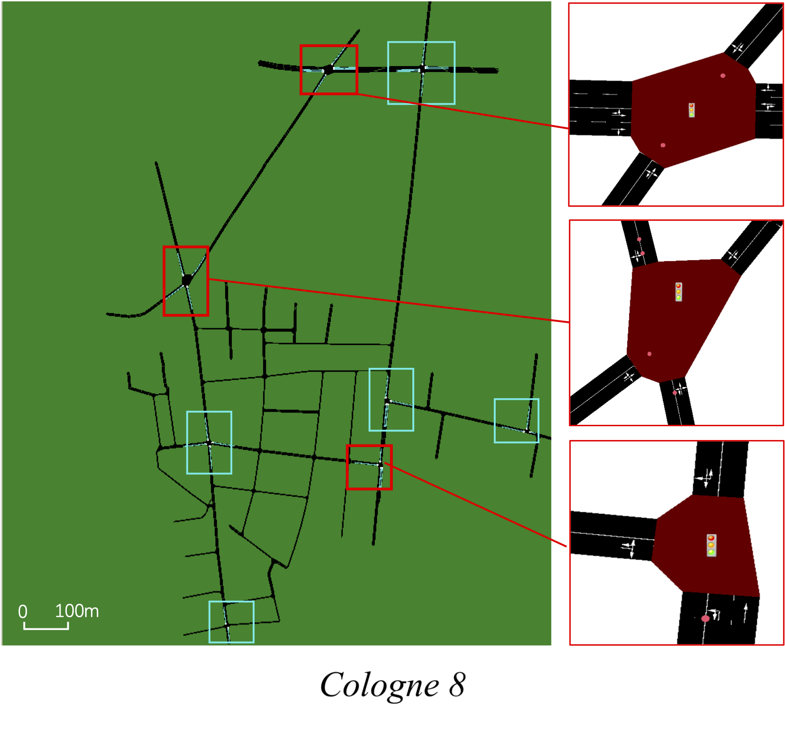

# CoSyncLight

## Overview

This repository contains the official implementation of CoSyncLight, a novel multi-agent reinforcement learning framework for intelligent traffic signal control, as presented in our paper "CoSyncLight: Spatio-Temporal Graph Representation with Dynamic Cooperation for Traffic Signal Control".

Traffic congestion is a critical challenge in modern urban areas. While recent deep reinforcement learning (DRL) approaches show promise for traffic signal control, most existing methods focus on real-time coordination and overlook historical traffic dynamics and congestion propagation patterns.

CoSyncLight addresses these limitations through:
* Spatio-temporal graph representations that unify spatial and temporal modeling
* Dynamic cooperation via adaptive agent coordination
* Progressive learning that refines strategies based on evolving traffic conditions

CoSyncLight outperforms 12 competitive baselines in over 80% of evaluated scenarios across both synthetic and real-world datasets, achieving superior performance in at least two of three key metrics (average travel time, delay time, and reward).

Our codes are based on [SUMO](https://sumo.dlr.de/docs/index.html), which is an open source microscopic traffic simulation package, and [Pytorch](https://pytorch.org/).

## Contents
1. Framework Overview
2. Install
3. Map Dataset
4. Training
5. Acknowledgements
## Framework Overview

  

The CoSyncLight framework comprises three core components working synergistically to enable adaptive traffic signal control:
* **Preprocessing Module**: This module processes historical traffic observations, segmenting them into multiple short-term spatio-temporal representations ($X_k$). These representations capture essential traffic dynamics across consecutive time steps for all intersections.
* **Dynamic Cooperation Module (DCM)** : This module takes the short-term representations ($X_k$) and utilizes bidirectional LSTM and Gumbel-Softmax mechanisms to learn adaptive cooperation matrices. It then applies graph convolution to extract context-aware dynamic spatio-temporal features ($M_k$) that reflect evolving cooperation patterns among intersections.
* **Recursive Refinement Mechanism:** This mechanism iteratively refines the features ($M_k$) from the DCM through multiple recursive loops to progressively capture complex long-range dependencies and multi-scale cooperation behaviors. The final historical representation ($\hat{h}$) is concatenated with the current observation ($h$) and fed into the policy network to generate coordinated actions ($a = \pi(\hat{h} || h)$). This recursive architecture enables the framework to adaptively learn sophisticated cooperation patterns while maintaining responsiveness to dynamic traffic conditions.

## Install
You can use any tool to manage your python environment. Here, we use conda as an example.
1. Install conda/miniconda.
2. `conda create -n cosynclight python==3.8` to create a new conda env.
3. Activate the env by `conda activate cosynclight` when you want to use it or you can add this line to your `.bashrc` file to enable it everytime you login into the bash.
4. Use `pip install -r requirements.txt` to install the required Python packages.

### Map Dataset
The map data used here comes from the paper [GESA](https://github.com/bonaldli/GESA). The dataset includes three synthetic maps (Avenue4x4, Grid4x4, Grid5x5) and two real-world maps (Nanshan and Cologne). The map images in SUMO is shown below.

  
  
  

## Training
1. The hyperparameters related to training are mainly defined in the `./CoSyncLight/config.py` file, and the map used for training is specified in the `./CoSyncLight/scripts/train/train_sumo.py` file.
2. Use `python ./CoSyncLight/scripts/train/train_sumo.py` to start training. The results will be saved in `CoSyncLight/results_and_models` directory.

## Acknowledgements

Our implementation is heavily based on the official codebase of [CoSLight](https://github.com/bonaldli/CoSLight) and [GESA](https://github.com/bonaldli/GESA), and we sincerely thank the authors for making their work publicly available.

Furthermore, our model was significantly inspired by the methodologies presented in the following papers, and we extend our gratitude to their authors:

[*Spatial-Temporal Synchronous Graph Convolutional Networks: A New Framework for Spatial-Temporal Network Data Forecasting*](https://ojs.aaai.org/index.php/AAAI/article/view/5438)

[*Multi-Agent GameAbstraction via Graph Attention Neural Network*](https://ojs.aaai.org/index.php/AAAI/article/view/6211)
